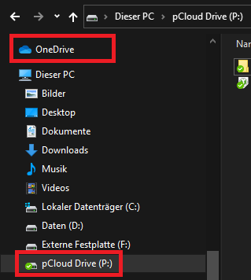
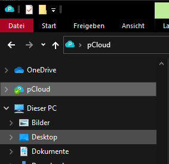

# Adding pCloud to the Windows Explorer sidebar

> **I shamelessly stole this from [svenkle](https://github.com/svenkle/google-drive-add-to-explorer), who shamelessly stole it from [luke.digital](https://luke.digital/adding-google-drive-to-the-explorer-sidebar/). :P**

For those of you who use OneDrive or Dropbox you may have noticed that they create non-removable shortcuts in the Explorer sidebar. 
If you are also a pCloud user you&#39;ll notice that pCloud doesn&#39;t create the same shortcuts.

Following the steps below you can create the same shortcut for pCloud.

**Disclaimer: This was only tested on Windows 10. Ensure you backup your registry before making any changes.**

## Installation

- Download this repository.
- Open  **pCloud.reg**  in your favorite text editor.
- Make sure every path is set appropriately. (`@="C:\\Program Files\\pCloud Drive\\pCloud.exe,0"` and `"TargetFolderPath"="P:\\"`)
- Save all changes
- Double-click  **GoogleDrive.reg**  to install and ensure you click yes when prompted.

## Results

You should now see pCloud pinned to the Explorer sidebar.

Credits: [**luke.digital**](http://luke.digital/adding-google-drive-to-the-explorer-sidebar/)
